# 03 — Architecture

A clean-room, local emulator of a **Databricks workspace** — the
`adb-*.azuredatabricks.net` REST host — built as a peer of
[fabric-emulator](https://github.com/calvinchengx/fabric-emulator). Fabric
*consumes* Databricks; this process *is* the workspace. Folding the workspace
API into fabric-emulator would blur the trust boundary the way inlining Key
Vault would have. The founding constraint is [Doctrine](00-doctrine.md).

```mermaid
graph TD
  clients["databricks-sdk / CLI / Terraform / databricks-connect / databricks-sql-connector / dbt-databricks / fabric activities"]
  ws["databricks-emulator :8447"]
  store["file store: workspace, DBFS, secrets, identity, MLflow"]
  agent["spark-agent HTTP /statements"]
  sail["Sail Spark Connect :50051"]
  uc["UC OSS sidecar"]
  kv["keyvault-emulator"]
  entra["entra-emulator JWKS"]
  clients --> ws
  ws --> store
  ws -->|"jobs, SQL, cluster session"| agent
  ws -->|"Databricks Connect gRPC"| sail
  agent --> sail
  ws -->|"optional DATABRICKS_UC_URL"| uc
  sail -->|"unity provider, Compose network"| uc
  ws -->|"optional AKV read-through"| kv
  entra -.->|"optional DATABRICKS_OIDC_ISSUERS"| ws
  entra -.->|"optional vault-audience mint"| ws
```

## What this process owns

The binary terminates the public workspace REST. Unmapped `/api/*` is 501
`NOT_IMPLEMENTED`, never a silent 200. Identity is **PAT + this process's own
OIDC**; Entra is an optional federated issuer, not a required STS — `make run`
needs no entra-emulator.

State lives under `DATABRICKS_DATA_DIR` (`./data` by default): hashed PATs,
the OIDC signing key, workspace files, DBFS bytes, Databricks-backed secrets,
git credentials, the MLflow tracking store, the persisted TLS pair.

## What it attaches, and refuses to invent

| Surface | Honest attach | If missing |
|---|---|---|
| Jobs / SQL / cluster session | HTTP statement agent at `DATABRICKS_SPARK_CONNECT_URL` (Sail behind the family's spark-agent). Warehouse SQL also arrives as HiveServer2 Thrift on `/sql/1.0/endpoints/{id}`. | Fail naming the engine — never `SUCCESS` / `RUNNING` |
| Databricks Connect | Spark Connect gRPC at `DATABRICKS_SPARK_CONNECT_GRPC_URL` (Sail `:50051`) | 501 naming the missing gRPC URL |
| Unity Catalog CRUD | UC OSS at `DATABRICKS_UC_URL` | 501 naming the missing sidecar |
| AKV-backed secrets | Live vault at `DATABRICKS_AKV_VAULT_HOST` | Emulator `dns_name` refused by name |
| Federated JWT | Issuer list in `DATABRICKS_OIDC_ISSUERS` | Only PAT and emulator OIDC work |
| Delta files | Sail `CREATE`/`INSERT` on a shared volume; **delta-rs** confirms the log. Three-part names: Sail's unity provider dials UC OSS on the Compose network | No write witness — a Sail `COUNT(*)` is not one |
| Git Credentials / Repos | `git` on PATH clones into `{dataDir}/workspace` | 501 naming the missing binary |
| Cluster policies | Enforced on `clusters/create`; unknown attributes 501 | — |
| Command Execution | Same HTTP statement agent as Jobs / SQL | Fail naming `DATABRICKS_SPARK_CONNECT_URL` |
| MLflow Experiments / Model Registry | File-backed store under `{dataDir}/mlflow` | — |

There is no invented metastore, no DuckDB answering as Photon, no cluster VM
that sleeps to `RUNNING`. A lookalike is a bug.

## MLflow tracking store

`/api/2.0/mlflow/experiments`, `/runs`, `/registered-models`, and
`/model-versions` persist under `data/mlflow/`. The unmodified SDK creates
an experiment, logs params and metrics, registers a model version, and
transitions its stage. Artifact list, `log-model`, traces, and logged-models
are 501 — this is a tracking store, not a model binary host. Model Serving
stays a different row.

## Two URLs, two protocols

`DATABRICKS_SPARK_CONNECT_URL` is the HTTP statement agent Jobs/SQL/cluster
create drive. `DATABRICKS_SPARK_CONNECT_GRPC_URL` is the Spark Connect
gRPC origin Databricks Connect is reverse-proxied to. An HTTP agent is
not Spark Connect. See [Jobs and the Spark attach](08-jobs-and-spark.md)
and [Clusters and Connect](11-clusters-and-connect.md).

## Witnesses

Every green row in [parity.md](parity.md) names a witness in
[witnesses.json](witnesses.json). The kinds are not equal evidence:
`ci:` is an unmodified client in CI; `go:` is this repo's own client. The
checker fails the build on a missing or dangling name.
[Testing](13-testing.md) lists what each CI job actually drives.
