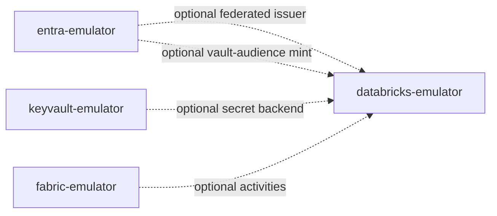

# 14 — Family integration

databricks-emulator is a peer in the
[Azure emulator family](https://github.com/calvinchengx/azure-emulators), not
a Fabric subsystem. Identity is Databricks-native. Entra, Key Vault, and
Fabric are optional companions that compose across HTTP the way they do in
production.



## azure-emulators compose

```bash
docker compose --profile databricks up   # :8447
```

The profile (image `ghcr.io/calvinchengx/databricks-emulator:0.2.0`) sets:

| Variable | Value |
|---|---|
| `DATABRICKS_PUBLIC_URL` | `https://databricks-emulator:8447` |
| `DATABRICKS_OIDC_ISSUERS` | entra's v2.0 issuer |
| `DATABRICKS_OIDC_TLS_INSECURE` | `true` |
| `DATABRICKS_AKV_VAULT_HOST` | `keyvault-emulator:8444` |
| `DATABRICKS_AKV_TLS_INSECURE` | `true` |
| `DATABRICKS_ENTRA_TOKEN_URL` | entra's client-credentials endpoint |
| `DATABRICKS_ENTRA_CLIENT_ID` / `_SECRET` | seeded daemon app |

It does **not** set `DATABRICKS_SPARK_CONNECT_URL` or
`DATABRICKS_SPARK_CONNECT_GRPC_URL`. Secret *read-through* and federated JWT
work; job *execution* and Connect still need Sail from this repo's
[engine attach](08-jobs-and-spark.md).

`make run` in this repo needs none of that. Entra is not a required STS.

## Fabric activities

fabric-emulator's Databricks activities refuse `dbfs:` / `/Workspace` /
`/Repos` unless `FABRIC_DATABRICKS_URL` points here. This process is the host
those paths resolve against. Point Fabric at this origin and a scraped PAT
(`FABRIC_DATABRICKS_TOKEN`); do not use `token=dev`.

A bare `--profile fabric` does not depend on `--profile databricks`.

## The chain test

[azure-emulators `e2e/chain`](https://calvinchengx.github.io/azure-emulators/04-chain-test/)
is the check no single emulator repo can make: **released images**, composed
together, still trust each other. For this workspace it asserts:

- the seeded PAT works on `/Me` and `token=dev` is 401;
- entra mints a Databricks-audience token
  (`2ff814a6-3304-4ab8-85cb-cd0e6f879c1d`) and `/Me` accepts it;
- fabric submits a `DatabricksSparkPython` activity against `dbfs:/jobs/chain.py`.
  The job exists. Failed naming the missing Spark engine is an honest pass —
  family compose has no Spark sidecar.

A foreign-issuer token is refused, so the accepts were not "validation is
absent".

That test proves the seam. What this process *does* with a valid token is
this repo's witnesses — [Testing](13-testing.md).
